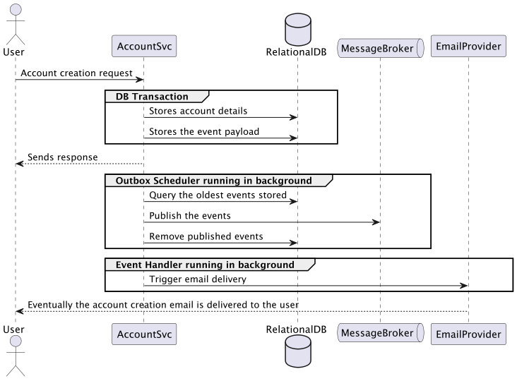
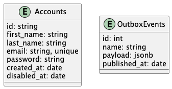

# Transactional Outbox Pattern - Event-driven Architecture

## Overview

This project implements one use-case that allows users to create an account by providing their personal details,
and as it's often the case with any real-life system that supports account creation, follow-up actions are usually
performed, such as sending a confirmation email via a transactional email provider.

### Objectives

The transaction email provider can be unavailable for myriad of reasons, ideally the users of this system should not be
prevented from creating an account when that occurs, which leads us to the following objectives:

- Decouple the interaction to the email provider from the command responsible for creating a user account through the usage of queueing system/message broker;
- Ensure atomicity while persisting the account details and publishing the event to the queue;
- Ensure that the account creation functionality remains available even when the message broker is unavailable.  

### Out of scope

- Implementation of a robust authentication system;
- Software design and architectural patterns such as ports and adapters;
- Observability
- Immediate retries of message publishing
- Idempotency

## Proposed solution and System architecture

The scenario described above as well as the objectives leads us to the transactional outbox pattern, which is described as:

> In a nutshell, the outbox pattern ensures the delivery of a database or external system and publishing to a messaging system within a single atomic unit by strictly avoiding two-phase commits (2PC).
> 
> _Source: [Spring Blog](https://spring.io/blog/2023/10/24/a-use-case-for-transactions-adapting-to-transactional-outbox-pattern)_

## Data design

- Accounts: Stores the account details
- OutboxEvents: Stores temporarily every event awaiting publishing

## Interface design

This solution exposes the following interfaces:

### HTTP API

- `[POST] /accounts`

### Events/Topics

- `AccountCreated`

## Assumptions

- Events from the outbox table can be republished more than once if an error occurs in the outbox scheduler. Event handlers are expected to be idempotent.
- Idempotency by allowing the email provider to confirm the delivery of an email through a webhook and persisting such confirmation in the database.

## References:

- [Transactional outbox pattern](https://docs.aws.amazon.com/prescriptive-guidance/latest/cloud-design-patterns/transactional-outbox.html)
- [Forwarder (the outbox pattern)](https://watermill.io/advanced/forwarder/)